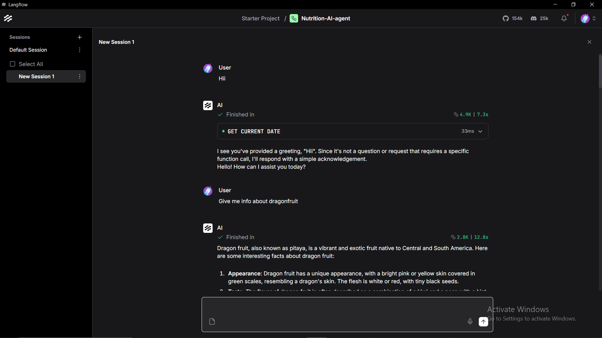
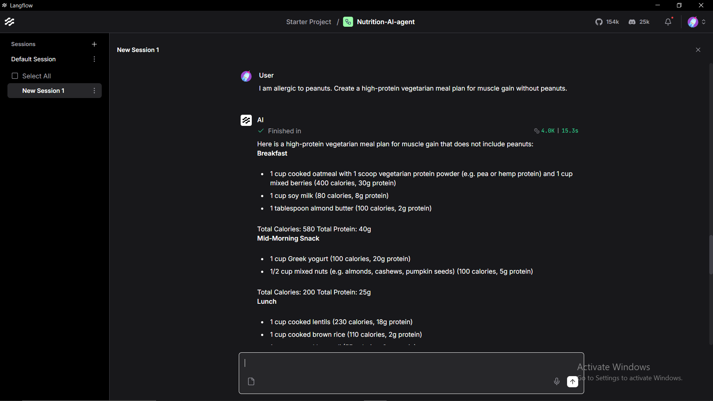

🥗 Nutrition AI Agent

An AI-powered nutrition assistant built with **Langflow** that provides interactive and personalized nutrition guidance based on user input.

✨ Features

* 🤖 AI-powered conversational nutrition assistance
* 🥗 Personalized nutrition guidance
* 🍽️ Meal-plan generation based on user requirements
* ⚠️ Considers dietary restrictions and allergies provided by the user
* 💬 Natural-language interaction
* ⚙️ Built with Langflow
* 📦 Importable Langflow workflow

🛠️ Tech Stack

* **Langflow**
* **LLM / Generative AI**
* **Prompt Engineering**
* **JSON**

📸 Demo

Nutrition Information
The agent can provide detailed information about foods and fruits based on the user's question.



Personalized Meal Planning
The agent can generate a personalized meal plan based on dietary preferences and restrictions.



⚙️ How to Use

1. Install Langflow
Install and open Langflow on your computer.

2. Import the Flow
Import the following file into Langflow:

`Nutrition-AI-agent.json`

3. Configure Your API Credentials
Configure your own LLM/API credentials inside Langflow.

> 🔐 API keys are not included in this repository. Never commit API keys, passwords, tokens, or other sensitive credentials to GitHub.

4. Run the Agent
Start the Langflow flow and interact with the Nutrition AI Agent through the chat interface.

🧠 How It Works

The user enters a nutrition-related question or requirement.
The Langflow workflow processes the input using the configured AI model and generates a natural-language response.
The agent can handle requests such as:

* Food and nutrition information
* Personalized meal planning
* Dietary preferences
* Food allergies and restrictions
* High-protein meal suggestions
* General nutrition-related questions

📁 Project Structure

```text
nutrition-ai-agent/
│
├── Nutrition-AI-agent.json
├── nutrition-details.png
├── ai-agent-working.png
└── README.md
```

🔐 Security

The exported Langflow workflow was uploaded **without saving API keys**.

Users should configure their own API credentials locally and should never upload secrets to a public repository.

⚠️ Disclaimer
This project is intended for **general informational and educational purposes only**.
It is not a substitute for professional medical, dietary, or healthcare advice. Users should consult a qualified healthcare or nutrition professional for personalized medical or dietary guidance.

👨‍💻 Author

**Nitesh Kumar**

Built with ❤️ using **Langflow and Generative AI**.

---

⭐ If you find this project useful, consider giving the repository a star!
